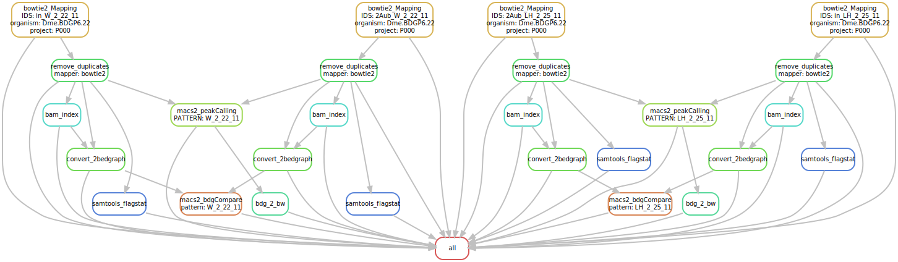

```{r setup, include=FALSE}
knitr::opts_chunk$set(echo = TRUE)
```

This workflow should able an automated workflow of chip-seq data sets.


An [environemnt.yaml](environment.yaml) file was created to contain the list of packages installed for the environment.

The installation with the above file failed due to conflicts, so I decided to do it manually. I have created the conda env with the command `conda create -n ChipSeq.Snakemake`. Then, after activating the environment, I installed the tools manually.

- deeptools
- meme, macs2
- samtools segemehl ucsc-wigtobigwig trimmomatic fastqc snakemake-minimal 
- bwa 
- bowtie2

(e.g. `conda install bwa`)

A [config.yaml] file contains all the needed parameters for the analysis. For each analysis, some parameters __must__ be changed for the workflow to run correctly.

1. link to the organism's fastA file
2. link to the gtf file

# creating the conda environment

```bash 
conda create --name chipseq

conda activate chipseq

conda config --add channels bioconda # add the bioconda channel to the conda env.

conda install snakemake-minimal  samtools bedtools cutadapt fastqc rseqc bwa bowtie2 picard macs2 bioconductor-chipseeker segemehl deeptools meme segemehl -c bioconda -c conda-forge -c r -c bioinfo
# This is not working on the cluster, so a workaround is to create the dag file and copy-paste it to the online version of the tool (https://dreampuf.github.io/GraphvizOnline/). 
conda install -c conda-forge graphviz # to enable the dot tool to create directed graphs
```

# setting the `config.yaml` file 

the same config file used for the genome indexing and star mapping is also used here.

This file contains a list of possible organisms with links to their `fastA` and `gtf` file. These links were used in the the snakefile genomeIndexing to create the indicies for the different mappers.

For now, the mappers we have are star (for RNA-Seq usually) and bwa, segemehl, bowtie2 for chip-seq data sets. 
General parameters for each of these mappers can be eset in the config file

One parameter set here is which mapper to use for the analysis. 
```bash
mapper: "bowtie2"
```
Here the value can be one of the three above mentioned mappers `bowtie2`,`bwa`, or `segemehl`.

```bash 
# For the bedgraph files.
effGenomeSize: 2652783500
```

The effektive genome size parameter is set for deepTools to calculate the values in each bin in `bamCoverage`. 

# the `snakefile`

For the workflow a [`snakefile`](ChipSeq.Snakemake) was created. Here, each steps is described as a rule and they are executed in a directed order of steps, each one depending on one (or few) steps before. The order of execution is also visualized in the attached image.


 
 It begins with the fastq files, converts them to different formats (bdg, bam, bai, peaks, etc.) and run different analyses. 
 
 # Snakefile run
 
 the snakefile run starts with mapping the files using the given mapper (in the example here I'll use `bowtie2`)
 (the samples in the examples commands were chosen arbitrary.)
 
 ```bash
bowtie2 --threads 16 --dovetail --very-sensitive-local --no-unal --no-mixed --no-discordant -X 2000 -x /fs/pool/pool-bcfngs/genomes/Dme.BDGP6.22/bowtie2Index/Dme.BDGP6.22 -1 2Aub_W_2_22_11.conc.R1.fastq.gz -2 2Aub_W_2_22_11.conc.R2.fastq.gz 2> P000/Dme.BDGP6.22/bowtie2/2Aub_W_2_22_11.log | samtools view -Sbhu -q 7 -@8 - | samtools sort -@8 - -o P000/Dme.BDGP6.22/bowtie2/2Aub_W_2_22_11.sorted.bam

picard MarkDuplicates I=P000/Dme.BDGP6.22/bowtie2/in_W_2_22_11.sorted.bam O=P000/Dme.BDGP6.22/bowtie2/in_W_2_22_11.rmdup.bam M=P000/Dme.BDGP6.22/bowtie2/in_W_2_22_11_rmdup_metric.txt REMOVE_DUPLICATES=true
 
samtools index P000/Dme.BDGP6.22/bowtie2/2Aub_W_2_22_11.rmdup.bam
```

Next the `bam` files are converted to `bedgraph`

```bash
bamCoverage --bam P000/Dme.BDGP6.22/bowtie2/2Aub_W_2_22_11.rmdup.bam --outFileName P000/Dme.BDGP6.22/bowtie2/bedgraph/2Aub_W_2_22_11.rmdup.bdg --outFileFormat bedgraph --binSize 10 --effectiveGenomeSize 2652783500 --extendReads 160 --normalizeUsing CPM --ignoreForNormalization chrX chrM
```

Peak calling is done using the `macs2` tool

```bash 
macs2 callpeak -t P000/Dme.BDGP6.22/bowtie2/2Aub_W_2_22_11.rmdup.bam -c P000/Dme.BDGP6.22/bowtie2/in_W_2_22_11.rmdup.bam -f BAM -g mm -n W_2_22_11 -B -q 0.05 --outdir P000/Dme.BDGP6.22/bowtie2/macs2/
macs2 callpeak -t P000/Dme.BDGP6.22/bowtie2/2Aub_W_2_22_11.rmdup.bam -c P000/Dme.BDGP6.22/bowtie2/in_W_2_22_11.rmdup.bam -f BAM -g mm -n W_2_22_11 --broad -B -q 0.05 --outdir P000/Dme.BDGP6.22/bowtie2/macs2/
```

And the bedgraph files can also be comapred with `macs2` to generate fold-enrichment track.

```bash
macs2 bdgcmp -t P000/Dme.BDGP6.22/bowtie2/bedgraph/2Aub_W_2_22_11.rmdup.bdg -c P000/Dme.BDGP6.22/bowtie2/bedgraph/in_W_2_22_11.rmdup.bdg -o W_2_22_11 --outdir P000/Dme.BDGP6.22/bowtie2/macs2/W_2_22_11.compared.bdg -m FE
```
 
 __add detailed-summary__ when the workflow is done
 
 __chipseeker__
 

